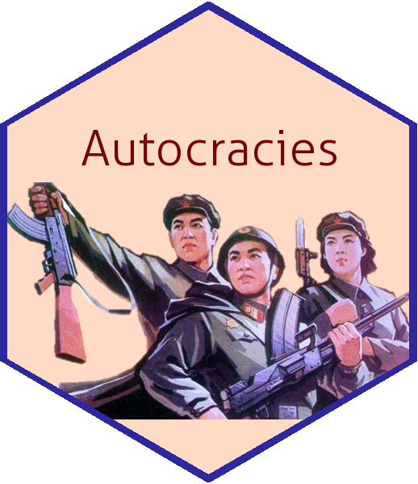

## HeteroDem     
- This is the repository for the research titled "Heterogeneous Democratization: Elite Politics and Economic Sanctions."
- This repository provides code (Currently not available) for replication.
- The Working draft pdf (Currently not available) 
- Slides are also posted here: [slides](https://github.com/pherephobia/Authoritarian.Welfare/blob/master/Documents/3_Slides/2020_IRCP_Park_PaperCompetition.pdf).
- Feel free to send me a message by [email](sp23@email.sc.edu) via [webpage](shpark.netlify.app) or [create an issue](https://github.com/pherephobia/HeteroDem/issues) on here. 
 

## Acknowledgment
It is a preliminary draft. Please do not cite or distribute without permission of the author.
